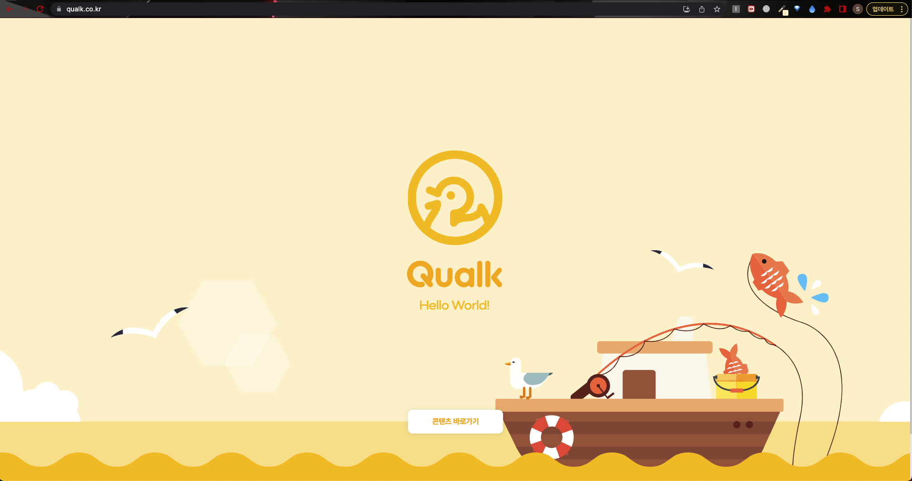
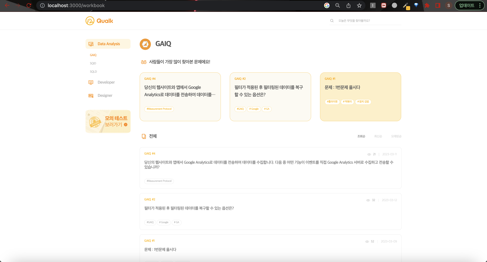
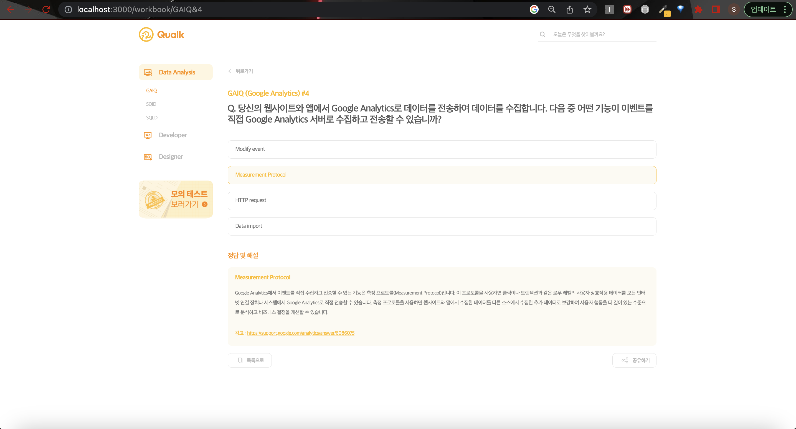
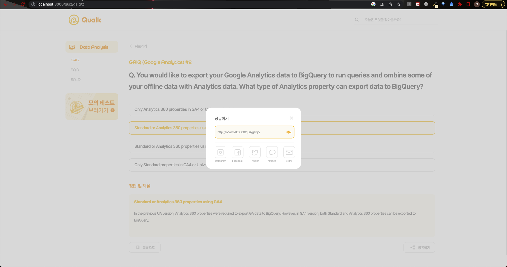
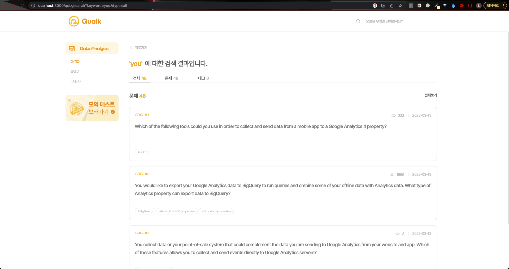

# Qualk - 🐤

## Front-end Source

`@lastest-update readme post: 2023-04-23`

---

This project is an application created using Create React App.


### Images





---

-  URL 설계중인 구조

| 구분 | 카테고리 | 페이지 이름 | URL                                                   | 비고                                                                |
| --- | --- | --- |-------------------------------------------------------|-------------------------------------------------------------------|
| 웹 | Common | 메인페이지 | `https://qualk.co.kr/`                                  |                                                                   |
| 웹 | Quiz | 검색페이지 | `https://qualk.co.kr/search?keyword={keyword}&type={type}` | `keyword` : 검색 키워드, `type` : zeplin 디자인 상 ‘전체’, ‘문제’, ‘태그’        |
| 웹 | Quiz | 퀴즈 메인 페이지 | `https://qualk.co.kr/openbook/`                             |                                                                   |
| 웹 | Quiz | 퀴즈 리스트 | `https://qualk.co.kr/openbook/menuName`                     | `menuName` : 메뉴 이름 예) GAC - google-analytics                      |
| 웹 | Quiz | 퀴즈 상세 | `https://qualk.co.kr/openbook/menuName/id`                  | `menuName` : 메뉴 이름, `id` : 해당 메뉴의 문제 고유 번호 예) id = 1, 30 (number) |
| 웹 | Quiz | 모의퀴즈 페이지 | `https://qualk.co.kr/openbook/test/`                        | `test` : 모의 퀴즈 페이지 depth                                          |
| 웹 | stack |  |                                                       |                                                                   |
| 웹 | wiki |  |                                                       |                                                                   |

---

### 1. How to use

- Install

```tsx
npm install
```

- Start

```tsx
npm start
```

---

### 2.Package.json

```tsx
{
    "name": "qualk-front",
        "version": "0.1.0",
        "private": true,
        "dependencies": {
        "@tanstack/react-query": "^4.23.0",
            "@testing-library/jest-dom": "^5.16.5",
            "@testing-library/react": "^13.4.0",
            "@testing-library/user-event": "^13.5.0",
            "@types/jest": "^27.5.2",
            "@types/node": "^16.18.11",
            "@types/react": "^18.0.27",
            "@types/react-dom": "^18.0.10",
            "dotenv": "^16.0.3",
            "prop-types": "^15.8.1",
            "react": "^18.2.0",
            "react-cookie": "^4.1.1",
            "react-dom": "^18.2.0",
            "react-helmet-async": "^1.3.0",
            "react-redux": "^8.0.5",
            "react-router-dom": "^6.7.0",
            "react-scripts": "5.0.1",
            "redux": "^4.2.0",
            "styled-components": "^5.3.6",
            "styled-reset": "^4.4.5",
            "typescript": "^4.9.4",
            "web-vitals": "^2.1.4"
    },
    "scripts": {
        "start": "react-scripts start",
            "build": "react-scripts build",
            "test": "react-scripts test",
            "eject": "react-scripts eject"
    },
    "eslintConfig": {
        "extends": [
            "react-app",
            "react-app/jest"
        ]
    },
    "browserslist": {
        "production": [
            ">0.2%",
            "not dead",
            "not op_mini all"
        ],
            "development": [
            "last 1 chrome version",
            "last 1 firefox version",
            "last 1 safari version"
        ]
    },
    "devDependencies": {
        "@types/styled-components": "^5.1.26",
            "typescript-plugin-css-modules": "^4.1.1"
    },
    "proxy": "http://localhost:8000"
}
```

---

### 3. Source Tree

```tsx
├── App.tsx
├──📁 assets
│   └──📁 images
│       ├──📁 main
│       │   ├── main_background-image.svg
│       │   └── main_logo.svg
│       ├──📁 public
│       │   ├── alert_icon.svg
│       │   ├── arrow_left_icon.svg
│       │   ├── arrow_left_icon_hover.svg
│       │   ├── check_icon.svg
│       │   ├── facebook_icon.svg
│       │   ├── facebook_icon_active.svg
│       │   ├── instagram_icon.svg
│       │   ├── instagram_icon_active.svg
│       │   ├── kakao_icon.svg
│       │   ├── kakao_icon_active.svg
│       │   ├── listview_icon_default.svg
│       │   ├── listview_icon_hover.svg
│       │   ├── mail_icon.svg
│       │   ├── mail_icon_active.svg
│       │   ├── modal_close_default.svg
│       │   ├── modal_close_hover.svg
│       │   ├── no_contents_logo.svg
│       │   ├── no_contents_logo_old.svg
│       │   ├── share_icon_default.svg
│       │   ├── share_icon_hover.svg
│       │   ├── twitter_icon.svg
│       │   ├── twitter_icon_active.svg
│       │   └── warning_icon.svg
│       └──📁 workbook
│           ├──📁 listview
│           │   ├── eye_image.svg
│           │   ├── eye_image_yellow.svg
│           │   ├── gaiq_logo.svg
│           │   ├── listview_logo.svg
│           │   ├── listview_logo_yellow.svg
│           │   ├── qualk_logo.svg
│           │   ├── qualk_logo_122_40.svg
│           │   ├──📁 sidebarmenu
│           │   │   ├── dataanalysis_logo.svg
│           │   │   ├── designer_logo.svg
│           │   │   ├── developer_logo.svg
│           │   │   └── test_banner.png
│           │   └── view_eye_icon.svg
│           └──📁 searchbar
│               ├── close_icon.svg
│               ├── search_icon.svg
│               └── search_icon_active.svg
├──📁 components
│   ├──📁 public
│   │   ├──📁 metaTag
│   │   │   └── SEOMetaTag.tsx
│   │   ├──📁 no-contents
│   │   │   ├── NoContents.module.css
│   │   │   └── NoContents.tsx
│   │   ├──📁 public-image-btn
│   │   │   ├── PublicImageBtnContainer.tsx
│   │   │   ├── PublicImageBtnPresenter.module.css
│   │   │   ├── PublicImageBtnPresenter.tsx
│   │   │   └── type
│   │   │       └── PublicImageBtnType.ts
│   │   ├──📁 searchbar
│   │   │   ├── SearchBarContainer.tsx
│   │   │   ├── SearchBarPresenter.module.css
│   │   │   └── SearchBarPresenter.tsx
│   │   ├──📁 share-post-modal
│   │   │   ├── SharePostModalContainer.tsx
│   │   │   ├── SharePostModalPresenter.module.css
│   │   │   ├── SharePostModalPresenter.tsx
│   │   │   ├──📁 share-platform-element
│   │   │   │   ├── SharePlatformElement.module.css
│   │   │   │   └── SharePlatformElement.tsx
│   │   │   └── type
│   │   └──📁 toast-msg
│   │       ├── ToastMsg.module.css
│   │       └── ToastMsg.tsx
│   └──📁 workbook
│       ├──📁 listview
│       │   ├── KeywordElement.module.css
│       │   ├── KeywordElement.tsx
│       │   ├── TopViewWorkbookElement.module.css
│       │   ├── TopViewWorkbookElement.tsx
│       │   ├── WorkbookElement.module.css
│       │   ├── WorkbookElement.tsx
│       │   ├── WorkbookListViewContainer.tsx
│       │   ├── WorkbookListViewPresenter.module.css
│       │   ├── WorkbookListViewPresenter.tsx
│       │   └── more-btn
│       │       ├── MoreBtnContainer.tsx
│       │       ├── MoreBtnPresenter.tsx
│       │       └── MorebtnPresenter.module.css
│       ├──📁 sidebarmenu
│       │   ├── ChildMenuComponent.module.css
│       │   ├── ChildMenuComponent.tsx
│       │   ├── MenuElementContainer.tsx
│       │   ├── MenuElementPresenter.module.css
│       │   ├── MenuElementPresenter.tsx
│       │   ├── SideBarMenuContainer.tsx
│       │   ├── SideBarMenuPresenter.module.css
│       │   └── SideBarMenuPresenter.tsx
│       ├──📁 type
│       │   └── WorkbookDataType.ts
│       └──📁 workbook-detail
│           ├── WorkbookDetailContainer.tsx
│           ├── WorkbookDetailPresenter.module.css
│           ├── WorkbookDetailPresenter.tsx
│           ├──📁 answer-and-explanation
│           │   ├── AnswerAndExplainContainer.tsx
│           │   ├── AnswerAndExplainPresenter.module.css
│           │   └── AnswerAndExplainPresenter.tsx
│           └──📁 question-view
│               ├── QuestionElement.module.css
│               ├── QuestionElement.tsx
│               ├── QuestionViewContainer.tsx
│               ├── QuestionViewPresenter.module.css
│               ├── QuestionViewPresenter.tsx
│               └── type
├──📁 hook
│   ├── useTheme.ts
│   └── useWorkbookData.ts
├── index.tsx
├──📁 javascripts
│   └── socialShare.ts
├── logo.svg
├── logo_re.svg
├──📁 queries
│   ├──📁 public
│   │   └── searchbar
│   └──📁 workbook
│       ├──📁 listview
│       │   ├── getQuestionFindNew.ts
│       │   ├── getQuestionFindOld.ts
│       │   ├── getQuestionFindView.ts
│       │   └── getQuestionTopView.ts
│       ├──📁 search
│       │   └── getSearchResult.ts
│       └──📁 workbook-detail
│           └── getQuestionDetailData.ts
├──📁 reducers
│   ├──📁 auth
│   │   └── authReducer.ts
│   ├──📁 public
│   │   └── toastMsgReducer.ts
│   ├── reducers.ts
│   └──📁 workbook
│       ├──📁 listview
│       │   ├── filterClickReducer.ts
│       │   └── workbookElementClickReducer.ts
│       ├──📁 sidebarmenu
│       │   ├── childMenuClickReducer.ts
│       │   └── menuElementClickReducer.ts
│       └──📁 workbook-detail
│           └── shareWorkbookClickReducer.ts
├──📁 routes
│   ├──📁 main
│   │   └── Main.tsx
│   ├──📁 notfound
│   │   └── NotFound.tsx
│   └──📁 workbook
│       ├── WorkbookContainer.tsx
│       ├── WorkbookPresenter.tsx
│       └──📁 search
│           ├── QuizResultContainer.tsx
│           ├── QuizSearch.tsx
│           └──📁 type
│               └── QuizResultContainerPropsType.ts
├──📁 store
│   └── store.ts
├──📁 stylesheets
│   ├──📁 main
│   │   └── Main.module.css
│   ├──📁 public
│   │   ├── animation.module.css
│   │   └── scrollbar.module.css
│   └──📁 workbook
│       ├── WorkbookPresenter.module.css
│       └── search
│           └── QuizSearch.module.css
└──📁 theme
    └── theme.ts

58 directories, 124 files
```

---

Copyright 2023. Team_LesserPanda. All rights reserved.
